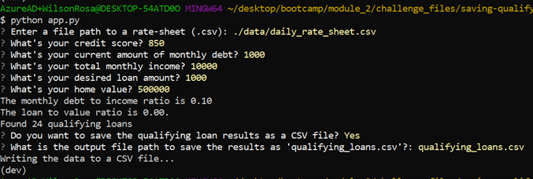

# Saving Qualifying Loan as a CSV File

This repo contains the module 2 assignment. The assignment is to add new features and enhancements to the loan qualifier application (`app.py`). Specifically, the added feature is the ability to save the qualifying loans to a CSV file.

The Fire and Questionary libraries were used to add more functionality. Our loan qualifier application uses a python command-line interface ("CLI") that allows users to see qualifying loans from lenders quickly and easily. The application works by taking in a `daily_rate_sheet` of loan criteria from various loan providers, asking the user a number of questions to evaluate their loan eligibility, and then returning to them a list of qualifying loans.

The application has been enhanced to allow a user to save the qualifying loans to a CSV file and be able to share the results as a spreadsheet. It now has the following functionality when the user runs the qualifier using the loan qualifier CLI. If there is a list of qualifying loans, the application prompts the user to either save the results as a CSV file or opt out of saving the file. If the user chooses to save results as a CSV file, the application then prompts the user for a file path to save the file. Once a file path is choosen, then the application saves the results as a CSV file according to the file path. However, if no qualifying loans exist, then the program notifies the user and exits.

---

## Technologies

This project leverages python 3.7 with the following packages:

* [fire](https://github.com/google/python-fire) - For the command line interface, help page, and entrypoint.

* [questionary](https://github.com/tmbo/questionary) - For interactive user prompts and dialogs

---
## Key Functions

### **Accessing Data File**

Rather than hardcoding the file path, Questionary is used via the CLI to load the latest banking data from the data rate sheet CSV file. The following steps were taken to enable this feature. Inside the `load_bank-data()` function, a Questionary prompt gets input from the user: `questionary.text("Enter a file path to a rate-sheet (.csv):").ask()`. The function appears as follows:

```python
def load_bank_data():

    csvpath = questionary.text("Enter a file path to a rate-sheet (.csv):").ask()
    csvpath = Path(csvpath)
    if not csvpath.exists():
        sys.exit(f"Oops! Can't find this path: {csvpath}")

    return load_csv(csvpath)
```
Now we can dynamically set the location of the `daily_rates_sheet.csv` file.

### **Prompt the User for Loan Information**

We created a dialog in a function named `get_applicant_info()` that will prompt the user for their loan information. All values received through Questionary are set to the type `string`, but, with the exception of `credit score` (set to `integer`), values must be set to `float` to perform floating-point arithmetic. The function appears as follows:

```python
def get_applicant_info():

    credit_score = questionary.text("What's your credit score?").ask()
    debt = questionary.text("What's your current amount of monthly debt?").ask()
    income = questionary.text("What's your total monthly income?").ask()
    loan_amount = questionary.text("What's your desired loan amount?").ask()
    home_value = questionary.text("What's your home value?").ask()

    credit_score = int(credit_score)
    debt = float(debt)
    income = float(income)
    loan_amount = float(loan_amount)
    home_value = float(home_value)

    return credit_score, debt, income, loan_amount, home_value
```
This function will prompt the user via the command line for the applicant's information, then return it so that values can be set for `credit_score`, `debt`, `income`,`loan_amount`, and `home_value`.

### **Find Qualifying Loans**

Based on the data collected by prompting the user for loan information, the monthly debt ratio and loan to value ratio of each applicant's loan is calculated. The data is then filtered to based on the loan qualification parameters to produce a list of qualifying loans. The find qualifying loans function appears as follows:

```python
def find_qualifying_loans(bank_data, credit_score, debt, income, loan, home_value):

    monthly_debt_ratio = calculate_monthly_debt_ratio(debt, income)
    print(f"The monthly debt to income ratio is {monthly_debt_ratio:.02f}")

    loan_to_value_ratio = calculate_loan_to_value_ratio(loan, home_value)
    print(f"The loan to value ratio is {loan_to_value_ratio:.02f}.")

    bank_data_filtered = filter_max_loan_size(loan, bank_data)
    bank_data_filtered = filter_credit_score(credit_score, bank_data_filtered)
    bank_data_filtered = filter_debt_to_income(monthly_debt_ratio, bank_data_filtered)
    bank_data_filtered = filter_loan_to_value(loan_to_value_ratio, bank_data_filtered)

    print(f"Found {len(bank_data_filtered)} qualifying loans")

    return bank_data_filtered
```
---
## Installation Guide

Before running the application first install the following dependencies.

```python
  pip install fire
  pip install questionary
```
---
## Usage
### **Saving Qualifying Loans**

1. If there is a list of qualifying loans, the application prompts the user to either save the results as a CSV file or opt out of saving the file. If no qualifying loans exist, then the program notifies the user and exits.

```python
def save_qualifying_loans(qualifying_loans):
    
    if not qualifying_loans:
        sys.exit("There are no qualifying loans.")
        
    action = questionary.confirm("Do you want to save the qualifying loan results as a CSV file?").ask()
```

2. If the user chooses to save results as a CSV file, the application then prompts the user for a file path to save the file. 

```python
    if action:
        csv_path_2 = questionary.text("What is the output file path to save the results as 'qualifying_loans.csv'?:").ask()
        
```

3. Once a file path is choosen, then the application `save_csv` function is called to save the results as a CSV file according to the entered file path. To save the filtered qualifying loans list, the following `save_csv` function is executed. The print function enhances usability by notifying the user that the file is being saved to a csv file. The function then opens the csvpath, collects the filtered data, writes it using a "," delimiter, and looks to see if the list has a header: 

```python
        save_csv(Path(csv_path_2), qualifying_loans)

def save_csv(csvpath, data, header = None):

    print("Writing the data to a CSV file...")
    with open(csvpath, "w") as csvfile:
        csvwriter = csv.writer(csvfile, delimiter=",")
        if header:    
            csvwriter.writerow(header)
        csvwriter.writerows(data)
```

### **Example of Output**

* 


---
## Contributors

Brought to you by Wilson Rosa. https://www.linkedin.com/in/wilson-rosa-angeles/.

---
## License

MIT

---
